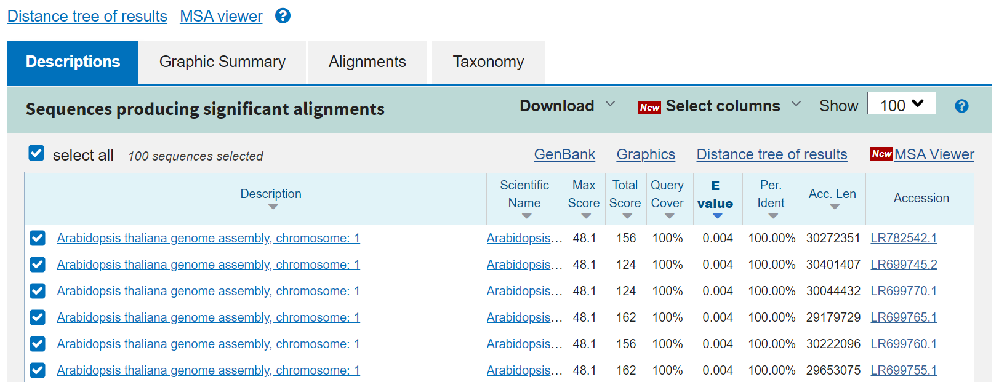
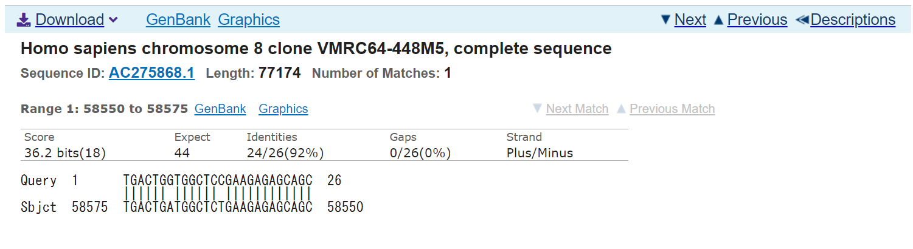

<!-- title: BLAST - database -->
[<戻る][link-return]

[link-return]: /bioinfo/bioinfo_database.html

# BLAST

update : 2021/04/30

https://blast.ncbi.nlm.nih.gov/Blast.cgi

- [BLAST](#blast)
  - [出来ること](#出来ること)
  - [配列間の相同性を検索](#配列間の相同性を検索)
    - [blastn (Nucleotide BLAST)](#blastn-nucleotide-blast)
    - [blastp (Protein BLAST)](#blastp-protein-blast)
  - [その他のお話](#その他のお話)
    - [アラインメントとスコア表](#アラインメントとスコア表)

## 出来ること

塩基配列やアミノ酸配列を様々なデータベースの配列と相同性検索(類似した遺伝子・タンパク質を検索)できる。

## 配列間の相同性を検索
### blastn (Nucleotide BLAST)
塩基配列 -> 塩基配列 で相同性検索する。

Enter Query Sequence に配列（FASTA形式など）を入れ(あるいはアップロード)、Choose Search Set の Database から調べたいデータベースを選択する。初期設定の "Nucleotide collection (nr/nt)" は、 nr = non-redundant つまり様々なデータベースのうち重複したデータを除いたデータベースを用いる。

BLASTボタンを押すと、一定時間ごとにジョブが完了したかを更新し、完了したら結果が見える。なお、miRNAのような短い配列を入力した場合は、この段階でそれ専用のパラメータ設定に切り替わる。

結果は以下のように表示される。

Max Score は[ローカルアラインメント](#アラインメントとスコア表)の最大値を、 E-value は、ランダムな配列同士で比較したときに同じスコアをとる配列数の期待値を、 "Per. Ident" = Identity は配列の相同性（一致率）を表している。Max Score はアラインメント的に長い配列の方が高くなりやすく、 Identity もローカルアラインメントとして部分的にしか見ていないので、E-value が指標としてよく用いられる。

Queryが入力した質問配列、Sbjctがデータベース上の配列で、アラインメントの様子が描かれている。

### blastp (Protein BLAST)
アミノ酸配列 -> アミノ酸配列 で相同性検索する。

Enter Query Sequence に配列（FASTA形式など）を入れ、Choose Search Set の Database から調べたいデータベースを選択する。Non-redundant protein sequences (nr) は前述したように重複を除いたもの。

## その他のお話

Basic Local Alignment Search Tool の略。

### アラインメントとスコア表

あああ