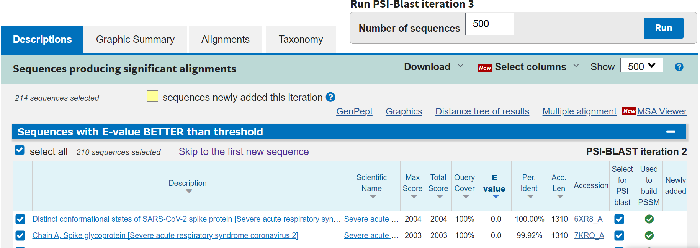
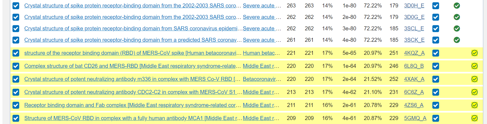

<!-- title: BLAST - database -->
[<戻る][link-return]

[link-return]: /bioinfo/bioinfo_database.html

# BLAST

update : 2021/04/30

https://blast.ncbi.nlm.nih.gov/Blast.cgi

- [BLAST](#blast)
  - [出来ること](#出来ること)
  - [配列間の相同性を検索](#配列間の相同性を検索)
    - [blastn (Nucleotide BLAST)](#blastn-nucleotide-blast)
    - [blastp, PSI-BLAST (Protein BLAST)](#blastp-psi-blast-protein-blast)
    - [マルチプルアラインメント](#マルチプルアラインメント)
  - [その他のお話](#その他のお話)
    - [アラインメントとスコア表](#アラインメントとスコア表)

## 出来ること

塩基配列やアミノ酸配列を様々なデータベースの配列と相同性検索(類似した遺伝子・タンパク質を検索)できる。

## 配列間の相同性を検索
### blastn (Nucleotide BLAST)
塩基配列 -> 塩基配列 で相同性検索する。

Enter Query Sequence に配列（FASTA形式など）を入れ(あるいはアップロード)、Choose Search Set の Database から調べたいデータベースを選択する。初期設定の "Nucleotide collection (nr/nt)" は、 nr = non-redundant つまり様々なデータベースのうち重複したデータを除いたデータベースを用いる。

BLASTボタンを押すと、一定時間ごとにジョブが完了したかを更新し、完了したら結果が見える。なお、miRNAのような短い配列を入力した場合は、この段階でそれ専用のパラメータ設定に切り替わる。

結果は以下のように表示される。

Max Score は[ローカルアラインメント](#アラインメントとスコア表)の最大値を、 **E-value** は、ランダムな配列同士で比較したときに同じスコアをとる配列数の期待値を、 "Per. Ident" = Identity は配列の相同性（一致率）を表している。Max Score はアラインメント的に長い配列の方が高くなりやすく、 Identity もローカルアラインメントとして部分的にしか見ていないので、E-value が指標としてよく用いられる。

Queryが入力した質問配列、Sbjctがデータベース上の配列で、アラインメントの様子が描かれている。Sequence ID は GenBankフォーマットデータへのリンク。

スコア表の変更やE-valueの制限などは[こちら](#アラインメントとスコア表)で

### blastp, PSI-BLAST (Protein BLAST)
アミノ酸配列 -> アミノ酸配列 で相同性検索する。

Enter Query Sequence に配列（FASTA形式など）を入れ、Choose Search Set の Database から調べたいデータベースを選択する。Non-redundant protein sequences (nr) は前述したように重複を除いたもの。他には、 UniProtKB や Protein Data Bank などが選べる。

結果などはblastnの時と同様。

BLAST ボタン上部の Program Selection にて他のアルゴリズムを実行できる。**PSI-BLAST** は Position-Specific Iterated BLAST の略で、BLASTで得られた複数の結果を再び入力としてBLASTにかけることを繰り返すことで、最初の検索では現れない比較的遠い配列も検出できるようにするというもの。繰り返し回数が1,2回ではファミリーが、より多くではスーパーファミリーが検出できることが多いという。

Algorithm にて PSI-BLASTを選択してBLASTを実行する。一回目の結果は以下のようになる。

右上の Run PSI-BLAST iteration 2 にて、結果のうち指定した数の配列を利用して2回目のBLASTを始められる。

新しく現れた配列は "Newly added" にて確認できる。

### マルチプルアラインメント

あああ

## その他のお話

Basic Local Alignment Search Tool の略。

### アラインメントとスコア表

アラインメントはグローバルなものとローカルなものがあり、前者はNeedleman-Wunsch法、後者はSmith-Waterman法（両方とも動的計画法）により求められる。BLASTは後者。動的計画法におけるスコアはマッチ・ギャップ・ミスマッチのそれぞれに対応したもの表の形式で与えられ、スコア表は塩基配列・アミノ酸配列のそれぞれで与えられる。

スコア表を変更するには、BLASTボタン下部の”Algorithm parameters”を開く。

Scoring Parameters にてスコアについての設定を変えられる。塩基配列の場合は、マッチ・ミスマッチスコアの値や、ギャップスコアが線形かextensionなどを含むかなどを変えられる。アミノ酸配列の場合はMatrixでスコア表を選ぶ。BLOSUM か PAM かを変更できる。

また、General Parameters の "Expect threshold" で E-value の閾値（これより小さな値のものしか表示しない）を設定できる。