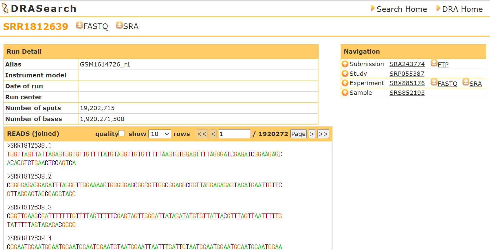
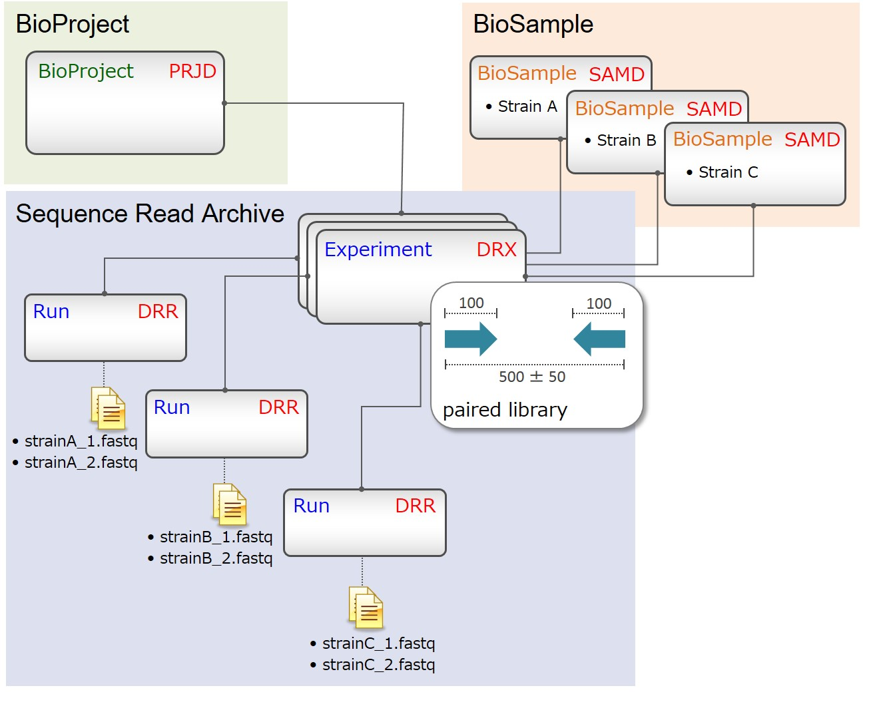

<!-- title: DRA Search - database -->
[link-return]: /bioinfo/bioinfo_database.html

# DRA Search (DDBJ)

update : 2021/05/02 (追加)

https://ddbj.nig.ac.jp/DRASearch/

- [DRA Search (DDBJ)](#dra-search-ddbj)
  - [出来ること](#出来ること)
  - [NGSデータを入手する](#ngsデータを入手する)
    - [Accession番号を知っているとき](#accession番号を知っているとき)
    - [生物種などから検索する](#生物種などから検索する)
  - [その他のお話](#その他のお話)
    - [Accession番号について](#accession番号について)
    - [lftpのインストール](#lftpのインストール)

## 出来ること

SRAからNGSデータを入手できる。生物や実験の種類で検索して、実験の詳細やNGSデータを落とせる。NCBI SRA や EBI ENA と同様のデータを入手できる。

## NGSデータを入手する
### Accession番号を知っているとき
SRA(Sequence Read Archive)は NCBI, EBI, DDBJ の3拠点で全く同じように保存されているため、少しのデータなら拠点が近く通信が速そうなDDBJから落としてくるのがよさそう。論文などに書かれたAccession番号からデータを入手できる。

＜Accession番号の例＞

DRR045547,
ERX040843,
SRP003111,
DRA003980

番号の意味は[こちら](#accession番号について)

Topページの Accession に番号を入れて Search ボタンを押す（あるいは入力後にEnterする）と次のようなページに飛ぶ（runの場合）



SRAファイルまたはFASTQファイルはftpによってダウンロードするため、bash で以下のようにして落とす。

1. [lftpをインストール](#lftpのインストール)しておく。

2. "FASTQ"か"SRA"と書かれたボタン上で右クリックし、リンクをコピーする。

3. 落としてきたいディレクトリへ移動(cd)したのち 
    ```bash
    lftp ftp://ftp.ddbj.nig.ac.jp/ddbj_database/dra/fastq/SRA243/SRA243774/SRX885176
    ```
    のようにして ftp に入る。

4. ls などでお目当てのファイルがあることを確認したのち
    ```bash
    get SRR1812639.fastq.bz2
    ```
    のようにしてダウンロードする。複数ある場合はmgetで。

5. ftp から抜ける場合は exit と打つ。

もし、複数のRunを一括でダウンロード・前処理したい場合は、[NCBI SRA の機能](SRA.html)を用いる。

### 生物種などから検索する

メインページで、Organism (生物種), StudyType (実験手法), Platform (機械) および Keyword で検索をかけられる。生物種は正式名称を打たなければいけないが、有名なものなどは下部にまとめてある。検索結果をクリックすれば後は先述した通りにすればダウンロード出来る。

## その他のお話

### Accession番号について

SRA の Accession番号は次の図のような関係に基づいて名づけられている（[DDBJ Sequence Read Archive Handbook](https://www.ddbj.nig.ac.jp/dra/submission.html) より引用）。



表でまとめると以下のようになる（引用：Dr.Bono の生命科学データ解析 p.33）

| SRA entries | DDBJ | EBI | NCBI |
| --- | --- | --- | --- |
| study | DRP | ERP | SRP |
| sample | DRS | ERS | SRS |
| experiment |DRX | ERX | SRX |
| run | DRR | ERR | SRR |
| analysis | DRZ | ERZ | SRZ |

基本的に頭文字の D, E, S は関係なく（すべてDRA Search から落とせる）、〇RR以下に FASTQ ファイルや SRA ファイルが存在する。

### lftpのインストール

apt を使っていれば、入っているはず。

```bash
sudo apt update -y & sudo apt upgrade -y
```

確認は

```bash
sudo apt show lftp
```

Homebrewで入れるなら

```bash
brew install lftp
```

[<戻る][link-return]