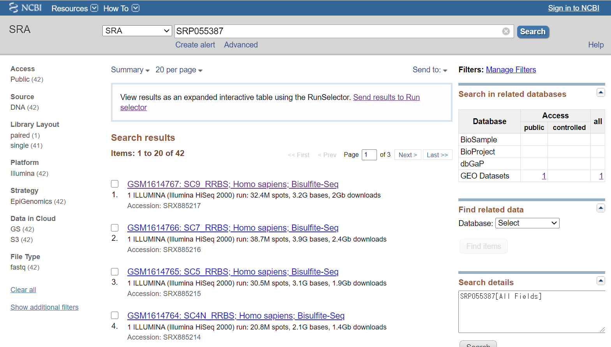
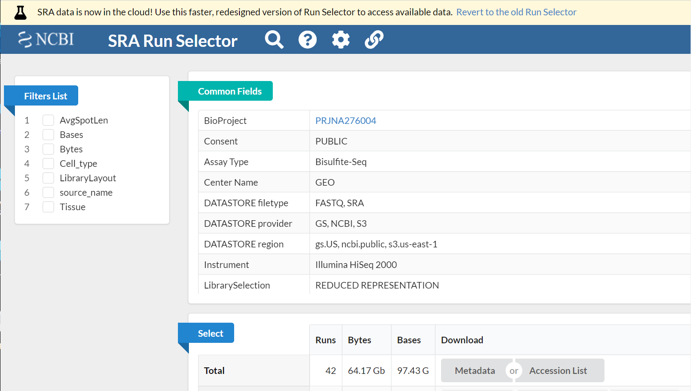
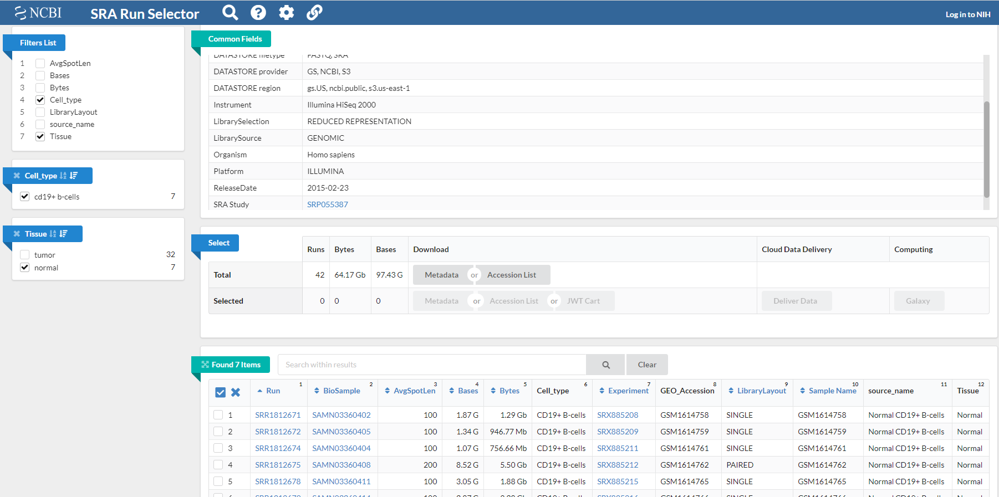

<!-- title: DRA Search - database -->
[link-return]: /bioinfo/bioinfo_database.html

# SRA (NCBI)

update : 2021/05/03 (SRA Toolkitへのリンク)

https://www.ncbi.nlm.nih.gov/sra

- [SRA (NCBI)](#sra-ncbi)
  - [出来ること](#出来ること)
  - [NGSデータを一括で入手する](#ngsデータを一括で入手する)
    - [Accession番号を知っているとき](#accession番号を知っているとき)
  - [その他のお話](#その他のお話)

## 出来ること

NGSデータを入手できる。生物や実験の種類で検索して、実験の詳細やNGSデータを落とせる。SRA Toolkit と組み合わせると欲しいデータを一括でダウンロードできる。

## NGSデータを一括で入手する
### Accession番号を知っているとき
論文などに書かれたAccession番号からデータを入手できる。

＜Accession番号の例＞

DRR045547,
ERX040843,
SRP055387,
DRA003980

番号の意味は[こちら](DRASearch.html#accession番号について)

上部の SRA 検索窓にAccession番号を入れて検索する。今回は"SRP055387" で検索してみる。



上部に "View results as an expanded interactive table using the Run Selector. Send resuolts to Runs selector" とかかれた注意があるので、Run Selector へ移る。



このサイトでは、自分の欲しい実験のNGSデータを選択して入手できるようにしている。左側の Filters list を用いると、欲しい実験結果のみを選択できるようになる。今回は例えば、Cell_type > cd19+ b-cells, Tissue > normal のように選択すると、以下のように7つのRunのみが選択される。



実際に欲しいデータにチェックを入れて、Select の Selected から (Download) Accession List を押して Accession番号のリスト SRR_Acc_List.txt をダウンロードする。

以下は次のように操作

1. [SRA Toolkitをインストール](../software/SRAToolkit.html)しておく。

2. 落としてきたいディレクトリへ移動(cd)したのち、SRA Toolkit の fasterq-dump コマンドを(繰り返し)用いてデータをダウンロードする（参考：[ばいばいバイオ氏のサイト](https://www.kimoton.com/entry/20190610/1560135569), DRY解析教本）。
    ```bash
    cat SRR_Acc_List.txt | while read line; do cmd="fasterq-dump --gzip --split-files ${line}"; eval ${cmd}; done
    ```
    while read line で SRR_Acc_List.txt 内を一行ずつ読み進め、fasterq-dump コマンドでダウンロードしている。オプションの --gzip は fastq.gz となるように圧縮することを、 --split-files は paired-end の場合に Forward と Reverse のデータを分けてダウンロードする（ single-end ならば不要）。

こうしてfastq.gzファイルを一括でダウンロードできた。

## その他のお話

[<戻る][link-return]