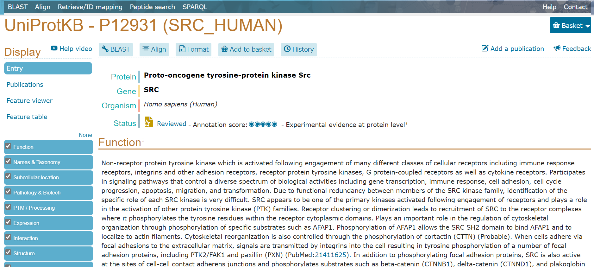
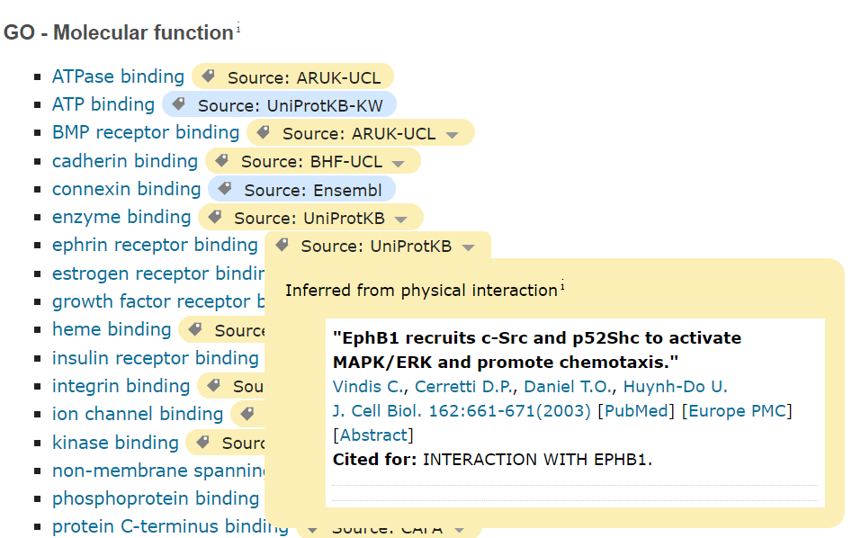
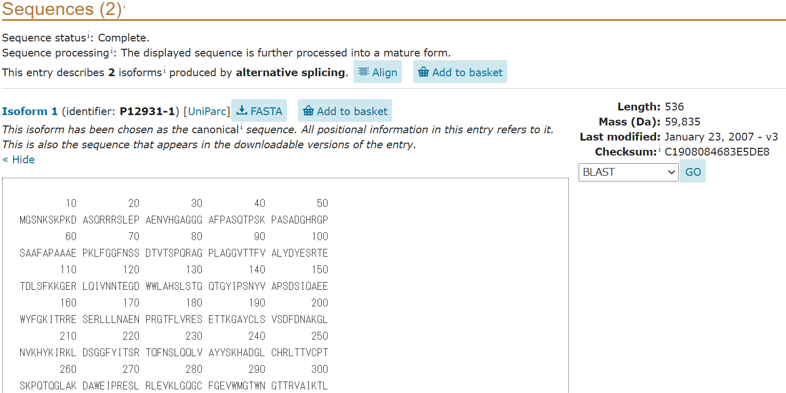

<!-- title: UniProt - database -->
[link-return]: /bioinfo/bioinfo_database.html

# UniProt

update : 2021/05/01 (追加)

https://www.uniprot.org/

- [UniProt](#uniprot)
  - [出来ること](#出来ること)
  - [タンパク質の情報を手に入れる](#タンパク質の情報を手に入れる)
    - [タンパク質・遺伝子名から](#タンパク質遺伝子名から)
  - [その他のお話](#その他のお話)

## 出来ること

アノテーション付きアミノ酸配列を取得できる。アミノ酸配列のFASTAデータや各種データベースへのリンクが分かる。

## タンパク質の情報を手に入れる
### タンパク質・遺伝子名から
”Src” などの名前を知っているタンパク質・遺伝子の情報を見に行く。

検索窓から遺伝子名で検索をかけて Entry から開く。

最初に名前や生物種、Status(アノテーションの質など)が載っている。なお、左側のタブから各種の情報へ素早く移ることができる。

**Function**ではそのタンパク質の機能の説明を見ることができる。Catalytic activity (酵素活性) や 主要なサイトなどが載っている。"GO - Molecular function", "GO - Biological process" では Gene Ontology ([biopapyrusさんの解説](https://bi.biopapyrus.jp/pathway/go/gene-ontology.html)) の情報を得られる。各情報はタグマークのタブを開くことで参照元を確認できる。

　

Enzyme and pathway databases では Reactome などのパスウェイデータベースの情報を見られる。

**Names & Taxonomy** は俗称などの情報や taxonomy (系統・分類) の情報を載せている。**Subcellular location** では細胞内の局在の様子を、UniProt annotation と GO - Cellular component の二種類で可しかしてある。**Pathology & Biotech** は医学的な話題や変異の情報、医薬系のデータベースへのリンクが存在している。

**PTM / Processing** では翻訳後修飾 (Post-Translational Modifications) の情報とデータベースへのリンクを、**Expression**, **Interaction** では遺伝子発現、相互作用の情報が載っている。Structure はPDBの立体構造を（帯状の部分で選択した位置が二次構造ごとに表示）、**Family & Domains** ではドメインなどのタンパク質の情報を得られる。

**Sequences** ではアミノ酸配列情報が得られ、また FASTA 形式でのダウンロードが可能である（FASTAボタンから）。BLAST検索をかけることもできる。

**Similar Proteins** は UniProt Reference Clusters に基づいて選ばれた類似タンパク質の情報が見られる。

**Cross-references** にてその他多くのデータベースへのリンクを見ることができる。

## その他のお話

UniProtKB の KB は Knowledge Base の略。

[<戻る][link-return]